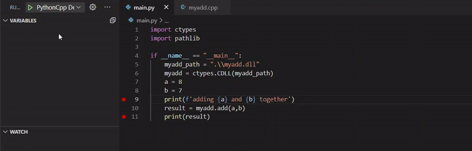

# VS Code Python C++ Debug

This debugger starts a python debugger and attaches a C++ debugger to it for debugging python code that calls functions from shared object files (.so/.dll).



## Python C++ Debug Requirements

To use this debug-extension you must have the following extensions installed:
* Python by Microsoft (ms-python.python)
* C/C++ by Microsoft (ms-vscode.cpptools)


## Default Configurations:

If you plan to use the default configuration of the python and/or C++ debugger, you don't need to define them manually.

* **Python:** `pythonConfig: default` will start the Python debugger with the default configuration (Python: Current File)
  
* **C++:** 
  - `cppConfig: default (win) Attach` will attach the C++ debugger with the `(Windows) Attach` config.
  - `cppConfig: default (gdb) Attach` will attach the C++ debugger with the `(gdb) Attach` config. This will also set the program path automatically to the path of the current python interpreter and lookup the gdb path.

```json
{
  "version": "0.2.0",
  "configurations": [
    {
      "name": "Python C++ Debug",
      "type": "pythoncpp",
      "request": "launch",
      "pythonConfig": "default",
      "cppConfig": "default (win) Attach",
    }
  ]
}

```

## Custom Configuartions:

To manually define the configurations you can set the attributes `pythonLaunchName` & `cppAttachName` to the name of the configuration you wish to use from your launch.json file.

 The following is an example launch.json file for windows users. If your working on Linux make sure to have a `(gdb) Attach` configuration instead of `(Windows) Attach`.

```json
{
  "version": "0.2.0",
  "configurations": [
    {
      "name": "Python C++ Debug",
      "type": "pythoncpp",
      "request": "launch",
      "pythonLaunchName": "Python: Current File",
      "cppAttachName": "(Windows) Attach",
    },
    {
      "name": "(Windows) Attach",
      "type": "cppvsdbg",
      "request": "attach",
      "processId": ""
    },
    {
      "name": "Python: Current File",
      "type": "python",
      "request": "launch",
      "program": "${file}",
      "console": "integratedTerminal"
    }
  ]
}

```

## What the debugger does

When you start Python C++ Debug it launches a Python debugger and attaches a C++ debugger to it by using the processId of the python debugger. As soon as both debuggers are attached the Python C++ debugger terminates.

## Additional information
* Make sure the shared object files (.so/.dll) you are loading your functions from have been compiled with `debug info`.
* Between consecutive `breakpoints` where one is located in python and the other in the C++ code, only the 'continue' button will work correctly.
* Additionally, the `restart button` isn't supported due to the Python debugger changing its processId after a restart. 
